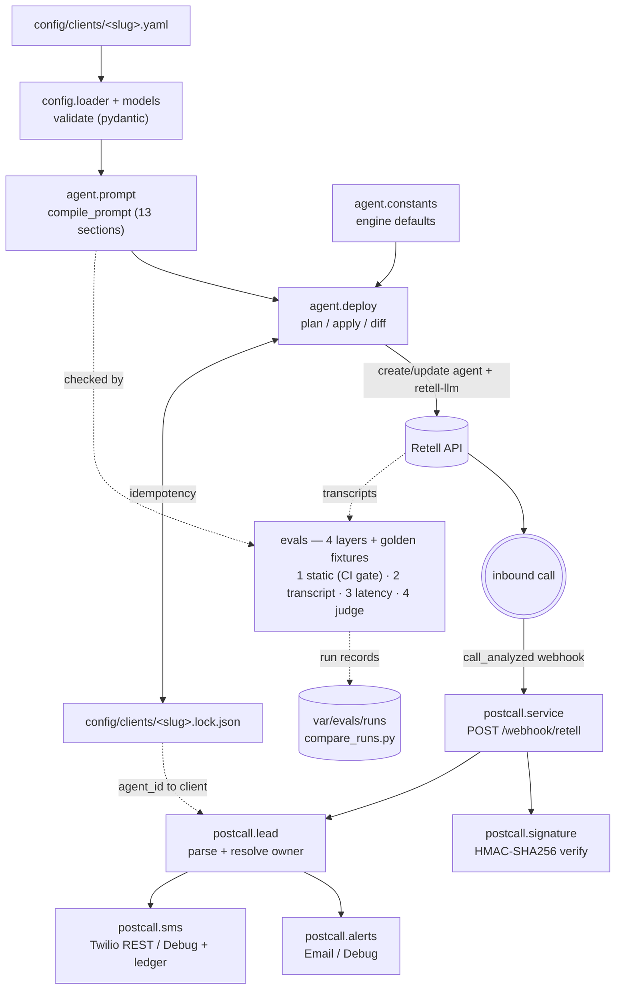

# dma-deploy-kit

A config-driven deployment kit for shipping bilingual (English/Spanish) AI voice receptionists built on [Retell](https://www.retellai.com/), with voices from Retell's voice library (which includes [ElevenLabs](https://elevenlabs.io/), Cartesia, and others).

## Overview

**The problem.** Small and mid-size businesses miss calls — after hours, during the lunch rush, when the front desk is already on another line. Every missed call is a missed booking, a lost lead, or a frustrated customer. For businesses serving bilingual communities, the gap is even wider: a caller who reaches an English-only line and needs Spanish (or vice versa) often just hangs up. Building a competent voice agent for each business is possible, but doing it by hand for every new client means re-solving the same problems — prompt wiring, voice selection, call routing, post-call follow-up — over and over, with no shared foundation and no way to keep quality consistent as the roster grows.

**The solution.** `dma-deploy-kit` turns "stand up a bilingual AI receptionist for a new client" into a repeatable, config-driven deployment. Each client is described by a single configuration file; the kit reads that config and provisions a Retell-backed conversational agent for each language, wires up escalation and post-call actions. Business logic lives in code that's shared across every deployment, so improvements ship to everyone at once — while each client's specifics (greeting, hours, guardrails, voices, escalation paths) stay in their own private config. Onboarding a new receptionist becomes editing a file, not rebuilding an agent.

**Who it's for.** This kit is built for DMA to deploy and operate bilingual AI voice receptionists for its clients — service businesses (clinics, dealerships, home services, professional offices, and similar) that take inbound calls and can't afford to let them go unanswered, especially where callers move between English and Spanish.

**Origin.** DMA built this kit after deploying voice receptionists one client at a time and watching the same work repeat with every new engagement. The insight was that the *differences* between clients are narrow and describable — a greeting, business hours, how calls should be routed, which voice, what happens after the call — while the *hard parts* are shared. Factoring the shared parts into a kit and pushing the differences into config makes each new deployment faster, more consistent, and easier to improve over time.

## Architecture



Everything left of the Retell API is deterministic Python. The model is confined to the live conversation; deploy, diffing, post-call routing, SMS gating, and evals are all plain code.

## Features

- **Config-driven clients.** One YAML file per client, validated by a strict pydantic schema (`extra="forbid"`, all errors reported at once with YAML-path locations).
- **Deterministic prompt compiler.** A fixed 13-section taxonomy compiled from config; pure function, no templating engine, no network.
- **Bilingual by construction.** One agent per language; English and Spanish prompts diverge only in the `LANGUAGE` section (and `SAMPLE LINES` when per-language lines are configured).
- **Idempotent deploy engine.** Dry-run plan by default; `--apply` creates/updates Retell agents + LLMs and writes a per-client lockfile. Re-runs compute a field-level diff and converge to `NOOP`.
- **Engine constants from production.** Agent/LLM settings that were identical across real production agents are pinned in code and applied to every deployment.
- **Guardrails.** Per-client `never_say` and `off_limits`, plus a `medical_adjacent` preset that stacks an engine-owned medical-safety block on top of the client's rules in `HARD RULES`.
- **Post-call webhook service.** FastAPI endpoint that verifies Retell's signature, parses the analyzed call into a lead, resolves which client owns the agent via the lockfiles, and dispatches an alert (email or debug log).
- **Consent-gated booking SMS.** Sends a booking-link text via the Twilio REST API only when consent, a booking URL, a captured consent flag, and a normalizable US phone all hold — with a send-once JSONL ledger so a webhook retry never double-texts.
- **Four-layer eval harness.** Static prompt-policy checks gate CI; deterministic transcript checks, latency-budget checks, and an LLM judge run advisory over real calls. A golden suite of synthetic fixtures also gates CI, so every push proves the checks still discriminate — not just that the code imports.
- **LLM judge with citation enforcement.** Layer 4 scores each transcript against a fixed rubric via the Anthropic API; every "fail" must quote a verbatim span from a cited turn or it is downgraded — the judge is structurally barred from unverifiable claims, not merely asked to be honest. Requires `ANTHROPIC_API_KEY` and never runs in CI.
- **Prompt-fingerprinted regression detection.** Every eval run writes a JSON record pinning the sha256 of each compiled prompt; `compare_runs.py` diffs two runs and flags a regression only when a check newly fires — so a prompt can change freely until it actually breaks something.
- **CLI tooling.** Preview a compiled prompt (`render_prompt.py`), plan/apply a deployment (`deploy_client.py`), and run the webhook service (`run_webhook.py`). Transcript fetching (`fetch_calls.py`) is deliberately hard-restricted to the agents in `config/clients/acme-wellness.lock.json` — it is the eval-harness feeder, not a general call exporter.

## Technology stack

`pyproject.toml` declares dependencies **unpinned** (only `pydantic>=2` carries a bound), so a fresh install resolves to current releases. The versions below are what a clean `pip install -e ".[dev]"` resolved to on 2026-07-23 — treat them as "known good", not as a lockfile.

| Tech | Resolved version | Why |
|---|---|---|
| Python | ≥ 3.11 (declared) | `datetime.UTC` (3.11+) and PEP 604 `X \| None` annotations. |
| pydantic | 2.13.4 | The config schema, strict validation, and aggregated error reporting. |
| httpx | 0.28.1 | Single HTTP client for **both** the Retell and Twilio REST APIs — no vendor SDKs, and a `MockTransport` makes those calls unit-testable. |
| FastAPI | 0.139.2 | The post-call webhook endpoint. |
| uvicorn | 0.51.0 | ASGI server for the webhook service. |
| PyYAML | 6.0.3 | Reading client config files. |
| tzdata | 2026.3 | IANA timezone validation that works on Windows too (no system tz db there). |
| python-dotenv | 1.2.2 | Loading `.env` for API keys and service settings. |
| Twilio | via REST | Booking SMS is sent by POSTing to Twilio's Messages API over httpx — no `twilio` package dependency. |
| ruff | 0.15.22 | Lint + import sort (`E,F,I,W,UP,B`, line length 100). |
| pytest | 9.1.1 | Test runner. |

The kit stores no database — the only persistent state is the per-client lockfile and (optionally) the SMS ledger, both flat files.

## Repo structure

```
src/dma_deploy_kit/
  config/     models.py (schema), loader.py (load + validate)
  agent/      prompt.py (compiler), constants.py (engine defaults), deploy.py (plan/apply/diff)
  postcall/   service.py, signature.py, lead.py, alerts.py, sms.py
  voice/      routing/   (reserved package dirs, currently empty)
scripts/      deploy_client.py, render_prompt.py, run_webhook.py, fetch_calls.py,
              capture_retell.py, report_capture.py, report_prompt_structure.py,
              validate_reexpression.py
evals/        static_checks.py, transcript_checks.py, latency_checks.py, judge_checks.py  (the 4 layers)
              run_static.py / run_transcripts.py / run_latency.py / run_judge.py         (per-layer runners)
              runlog.py (run records), run_fixtures.py (golden CI gate), compare_runs.py (regression diff)
              fixtures/  (synthetic gating scenarios)
config/       client.example.yaml   (clients/ is gitignored — real configs + lockfiles)
docs/         deployment.md, decisions.md, case-studies/
tests/        196 tests
```

## Getting started

```bash
git clone https://github.com/danielfmonzon/dma-deploy-kit.git
cd dma-deploy-kit
python -m venv .venv && source .venv/bin/activate   # Windows: .venv\Scripts\Activate.ps1
pip install -e ".[dev]"
cp .env.example .env                                # then edit .env
```

The editable install is required — the scripts and evals import `dma_deploy_kit`, and several modules locate `config/clients/` and `var/` relative to the source tree.

### Environment variables

Only `RETELL_API_KEY` is needed to deploy agents. The rest are for the optional post-call service.

| Variable | Needed for | What it is |
|---|---|---|
| `RETELL_API_KEY` | deploy + fetch | Your Retell API key (create/update/get agents & LLMs, list/get calls). |
| `RETELL_WEBHOOK_KEY` | webhook service | The Retell API key with the "webhook" badge; it signs `X-Retell-Signature`. The service refuses to start without it. |
| `WEBHOOK_BASE_URL` | wiring webhooks | Public base URL of the webhook service; when set, deploy sets each agent's `webhook_url` to `<base>/webhook/retell`. |
| `TWILIO_ACCOUNT_SID` / `TWILIO_AUTH_TOKEN` / `TWILIO_FROM_NUMBER` | booking SMS | Twilio REST credentials + sender. All three set ⇒ real SMS; otherwise DebugSms (logs only). |
| `SMTP_HOST` / `SMTP_PORT` / `SMTP_USER` / `SMTP_PASSWORD` / `SMTP_FROM` | email alerts | SMTP settings for `EmailAlert`, used only when a client config sets `alert_email`. |

### Run it locally

```bash
python scripts/render_prompt.py config/client.example.yaml --language en-US   # preview a prompt
python scripts/deploy_client.py config/client.example.yaml                    # dry-run plan
python evals/run_static.py                                                    # static prompt checks
python scripts/run_webhook.py                                                 # webhook service on :8010
```

Notes on the two that touch the outside world:

- **`deploy_client.py` (dry-run)** needs no API key and makes no network calls *while no lockfile exists* — it plans a `CREATE` per language offline. Once `config/clients/<slug>.lock.json` exists, the dry-run issues read-only `get-agent` / `get-retell-llm` calls to Retell to diff against live state, so it does need `RETELL_API_KEY` from then on. It never mutates without `--apply`.
- **`run_webhook.py`** fails closed: with no `RETELL_WEBHOOK_KEY` it exits non-zero with `RuntimeError: RETELL_WEBHOOK_KEY is missing`. With the key set it serves `/healthz` (`{"status":"ok","managed_agents":N}`) and `/webhook/retell`, which returns **401** for any request without a valid `X-Retell-Signature`. Logs go to `postcall.log`.

### Test commands

```bash
ruff check .
pytest
python evals/run_static.py
```

`run_static.py` always checks `config/client.example.yaml`, plus any `config/clients/*.yaml` you have locally. Those are gitignored, so CI sees only the example — expected.

See [docs/deployment.md](docs/deployment.md) for the full new-client walkthrough.

## Example workflow

The **tooling** path from clone to two live agents is dominated by `pip install`; every kit-owned step — config generation, dry-run, apply — is sub-second. That is the point: the real cost of a new client isn't engineering, it's gathering the business facts that fill the config (hours, services, guardrails, voices, escalation). Once you have those, standing up the agents is essentially free, so the **engineering cost per additional client approaches zero**.

```bash
# 1. clone + install (once per machine)
git clone https://github.com/danielfmonzon/dma-deploy-kit.git && cd dma-deploy-kit
python -m venv .venv && source .venv/bin/activate
pip install -e ".[dev]"
cp .env.example .env            # set RETELL_API_KEY

# 2. create the client config from the example, then edit the fields
cp config/client.example.yaml config/clients/acme-wellness.yaml
$EDITOR config/clients/acme-wellness.yaml

# 3. dry-run, review the plan, then apply
python scripts/deploy_client.py config/clients/acme-wellness.yaml
python scripts/deploy_client.py config/clients/acme-wellness.yaml --apply

# 4. re-run the dry-run — it should now report NOOP for every language
python scripts/deploy_client.py config/clients/acme-wellness.yaml

# 5. test the agents from the Retell dashboard
```

*What has been measured:* the offline steps — clone, scripted config generation (a small generator that copies the example and sets a second client's fields, so no human typing time is counted), and the first-time dry-run plan — total well under two seconds on a warm machine. The two remaining steps are not offline-reproducible and are therefore not quoted here: `pip install -e ".[dev]"` depends on network and pip-cache state and dominates the wall clock, and `--apply` depends on live Retell API latency. An end-to-end figure was recorded during development against a real account (two agents created, then torn down and verified deleted); it is deliberately not restated as a headline number, because it is not reproducible from this repo alone.

## AI

**Prompt architecture.** Every agent's system prompt is compiled by `agent/prompt.py` from the client config into a fixed **13-section taxonomy**: `IDENTITY, LANGUAGE, SPEAKING RULES, FACTS, STYLE / VOICE, THE GOAL, CONVERSATION FLOW, QUALIFY, BOOKING / SMS CONSENT, CAPTURING DETAILS, ESCALATION, HARD RULES, SAMPLE LINES`. The taxonomy and the "shared craft" sections are engine-owned; only the sections that genuinely differ per client (FACTS, LANGUAGE, ESCALATION, HARD RULES, CAPTURING DETAILS, and per-language SAMPLE LINES) are driven by config. Retell response-engine settings that were identical across real production agents — model (`claude-4.6-sonnet`), `tool_call_strict_mode`, `start_speaker`, the `end_call` tool, and agent knobs like interruption sensitivity — are pinned as engine constants in `agent/constants.py`.

**Bilingual handling.** Each language is a `LanguageProfile` (code, voice, greeting, optional notes and sample lines). The kit deploys **one agent per language**, and every agent advertises the full set of the client's language codes so a caller can switch mid-call. The compiled English and Spanish prompts are byte-identical except for the `LANGUAGE` section — and `SAMPLE LINES` when a client supplies per-language example lines. Static checks enforce that divergence rule and that a Spanish profile's greeting actually reads as Spanish.

**Guardrails.** A client's `never_say` lines are rendered verbatim into `HARD RULES`. Setting `guardrails.preset: medical_adjacent` stacks an engine-owned medical-safety block (no diagnosis, no outcome guarantees, no dosage/aftercare advice, no FDA claims) on top of the client's own rules — the two accumulate rather than replace. Static evals assert the block is present when the preset is on and absent when it's off.

**Eval strategy.** Four layers plus two cross-cutting mechanisms. **Layer 1** (`evals/static_checks.py`) checks the compiled prompt against policy — guardrail coverage, greeting language, section structure, caller/derived field placement — with no network, and gates CI. **Layer 2** (`evals/transcript_checks.py`) runs deterministic checks over real call transcripts — human-impersonation claims, SMS promises without captured consent, forbidden phrases derived from guardrails, and first-turn language. **Layer 3** (`evals/latency_checks.py`) compares each call's e2e/llm/tts/asr percentiles against a documented budget. **Layer 4** (`evals/judge_checks.py`) has an LLM score each transcript on a fixed rubric (booking intent, hallucinated commitments vs. the compiled FACTS, unresolved requests) via the Anthropic API, with *citation enforcement*: a "fail" whose quote isn't found verbatim in a cited turn is downgraded to `judge_citation_unverified` rather than asserted. Layers 2–4 are advisory over real calls. Cross-cutting: a golden synthetic-fixture suite (`evals/run_fixtures.py`) gates CI so the checks are proven to still discriminate on every push, and every run writes a prompt-fingerprinted record that `evals/compare_runs.py` diffs for regressions.

Two honest notes on discrimination power. Layer 4's is proven by *synthetic* tests — a fabricated-quote verdict is downgraded, a malformed reply becomes `judge_output_invalid` — not by real catches: the five real Acme calls judged all passed. Layer 3 holds the one real-data catch — one captured production call's e2e p90 of 4414 ms exceeds the 4000 ms budget, and the layer flagged it.

This kit does **not** do retrieval-augmented generation, model routing, or custom streaming — Retell owns the realtime media and model invocation; the kit owns configuration, deployment, and post-call handling.

## Developer experience

- **196 tests** (`pytest`), running in a few seconds; external APIs (Retell, Twilio, Anthropic) are exercised through httpx `MockTransport`, and the webhook flow through FastAPI's `TestClient`. The suite is hermetic: tests that assert env-dependent behavior clear the relevant variables, so a machine with real Twilio, Anthropic, or `WEBHOOK_BASE_URL` settings gets the same result as CI.
- **ruff** for lint + import sorting (`select = E, F, I, W, UP, B`, line length 100).
- **CI** (`.github/workflows/ci.yml`, Python 3.11 on ubuntu-latest) runs five steps on every push and PR: install, `ruff check .`, `pytest`, `python evals/run_static.py` (the static-eval gate), and `python evals/run_fixtures.py` (the golden fixture gate). The judge layer never runs in CI — it needs a key CI doesn't have.
- **No hidden state in tests.** Side-effecting resources (SMS ledger, alert sinks) are injected in tests so nothing writes to real runtime files — a lesson learned the hard way (see below).

## Design decisions

The full log with dates and rationale is in [docs/decisions.md](docs/decisions.md). The load-bearing ones:

- **Config over code.** The shared prompt craft is engine-owned and deliberately *not* client-configurable — configurability there would recreate the bespoke-per-client trap the kit exists to escape. (Unchanged through eval v2.)
- **Deterministic pipeline; the LLM owns dialogue only.** Everything outside the live conversation is plain, testable Python.
- **Deterministic layers gate; the judge advises.** Static checks and the synthetic-fixture suite gate CI; the transcript, latency, and LLM-judge layers run advisory over real calls — and the judge needs an API key CI intentionally doesn't have.
- **Citation enforcement over trust.** The LLM judge is structurally prevented from asserting a claim it can't quote verbatim from the transcript — an unverifiable "fail" is downgraded to its own finding, not believed.
- **Lockfile idempotency + dry-run default.** Plans diff desired vs. live and converge to `NOOP`; the default command mutates nothing.
- **caller/derived + role markers on post_call fields.** These decide what the agent asks for vs. summarizes, and which fields drive SMS — deterministically.
- **Sanitized-public / private-config split.** The example config is fictional; real configs, lockfiles, capture dumps, and the SMS ledger are all gitignored.

## Lessons learned

Written from this build's actual scars.

- **Test-isolation ledger pollution.** The webhook tests called `create_app()` without injecting an SMS ledger, so a `call_analyzed` test wrote a gated (Debug) SMS row to the *real* `var/sms_ledger.jsonl`. I only noticed because I was checking that the ledger was clean before a live test. Fix: inject every side-effecting resource in tests; never let a production default path be reachable from a test. What I'd do differently: make the default ledger path require an explicit opt-in, so a test can't silently hit it.
- **An invented voice id nearly broke a live apply.** I'd put a placeholder `voice_id` (`retell-Marta`) in the example that didn't exist on the account. It would have failed `create-agent` *after* the LLM was already created, orphaning a resource with no lockfile entry. I caught it by pre-flighting the voice against `list-voices` before the first real deploy. What I'd do differently: bake that pre-flight into `plan` itself (it's on the roadmap).
- **A specified warning got silently dropped.** An `sms_consent` deploy warning was called for in one step and I built the deploy without it, only catching it a step later when the plan didn't match the expected output. Tests were green — they just didn't cover a thing that was never written. What I'd do differently: check deliverables against the task's own checklist, not only against "does the suite pass."
- **Paginated list endpoints bit me twice.** `list-agents` returns `{"items": [...]}` and Retell's `v3/list-calls` also returns `{"items": [...]}`, but I first parsed `{"agents"...}` / `{"calls"...}` and got zero results both times — once silently reporting "no agents," once "0 calls." What I'd do differently: never assume a list endpoint returns a bare array; log the envelope keys the first time you hit a new one.
- **A golden gate isn't proven until you've watched it fail.** After wiring the synthetic-fixture suite into CI, a green run told me nothing — a gate that never fails and a gate that can't fail look identical. So I edited one fixture's expected checks to something wrong, confirmed the runner exited 1 with the precise diff, then reverted and confirmed green again. Only then was it a gate. What I'd do differently from the start: treat "demonstrate the failure path" as part of shipping any gate, not an afterthought.
- **An LLM judge has to be *structurally* barred from unverifiable claims.** Prompting a model to "only report what you can cite" is not enough — it will still occasionally assert a confident, ungrounded "fail." The fix that actually holds is mechanical: every fail verdict must include a quote, and the runner checks that quote appears verbatim in a cited turn; if it doesn't, the finding is downgraded to `judge_citation_unverified` regardless of how sure the model sounded. The discrimination proof is a synthetic test that feeds a fabricated quote and asserts the downgrade — because the five real calls all passed and couldn't prove it.
- **A same-slug fingerprint collision, caught before anything depended on it.** Run records first keyed prompt fingerprints by `slug/language`, but `client.example.yaml` and a local `clients/acme-wellness.yaml` both carry slug `acme-wellness`, so their fingerprints silently overwrote each other in one run's record. I caught it while eyeballing a record before building `compare_runs.py` on top of those keys. Fix: key by `path::language` instead. What I'd do differently: sanity-read the artifact a new tool will consume *before* writing the tool, not after it misbehaves.

## Roadmap

Deferred, with rationale, in [docs/decisions.md](docs/decisions.md#roadmap-deferred-not-built): voice pre-flight inside `plan`, incremental per-language lockfile writes, field-ownership / explicit-unset in the differ, first-class delete/deprovision, an hours "closed day" model, per-client SMS numbers, and a stable (named-tunnel / VPS) home for the webhook service. (The LLM-judge eval layer, previously listed here, shipped as Layer 4 — see below.)

## Proof, not claims

The repo *is* the proof: 196 passing tests, a CI-gated static-eval and golden fixture suite, and a fresh-clone deployment exercised end-to-end (above). The advisory layers have been run against the real Acme test calls: the transcript and judge layers came back clean — the judge's discrimination power is proven by synthetic tests, not by real catches — while the latency layer caught a genuine budget breach (one captured call's e2e p90 of 4414 ms exceeds the 4000 ms target). Deployment history for real clients is private by design — see [docs/case-studies/](docs/case-studies/) for a truthful index without client data.
